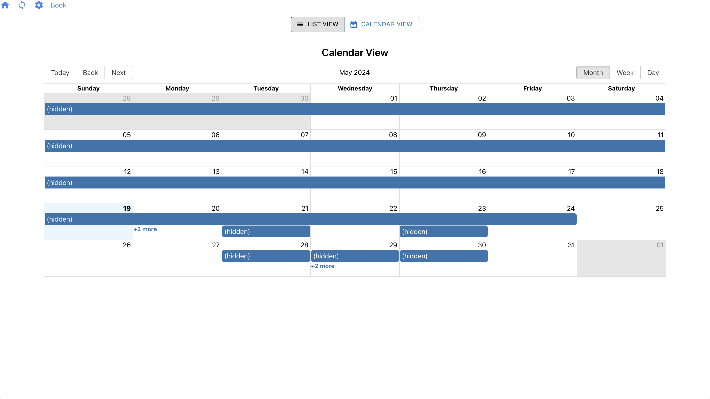
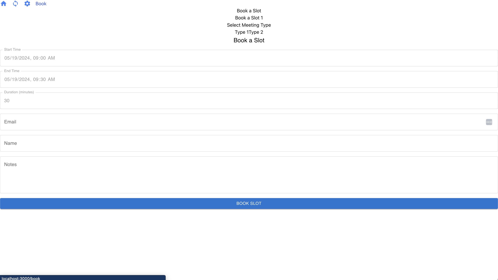

# Web 5 Calendly

Personal private calendar coordination. As it should be.

## State

WIP: Nothing is live yet. 

## Integrations 

- Google Calendar

## Screenshots

### Integrate with Other Calendar

### Choose a Booking Time

## Upcoming

- [ ] Fix build hosting process
- [ ] CalendarService with DWN Storage Backend
- [ ] Pollyfill error fix
- [ ] Sync with Google Calendar to Local DWN
- [ ] Test Public / Private Endpoints
- [ ] Protocol Definitions
- [ ] Share VC on Meeting. Present it when logging in to meeting? 
